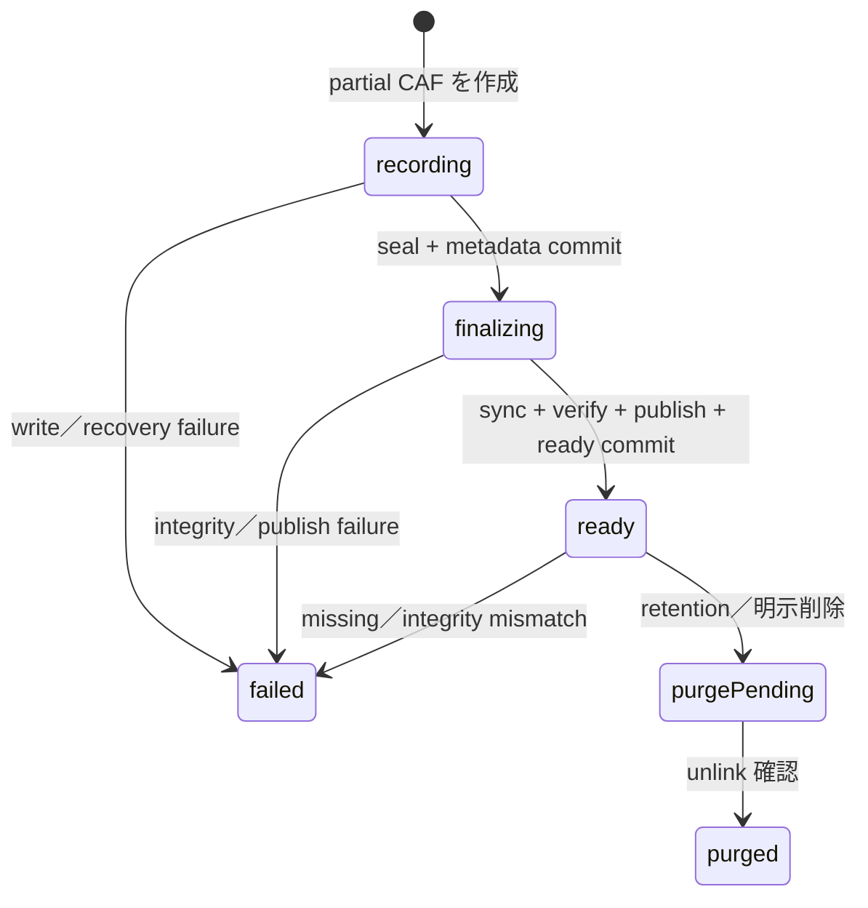
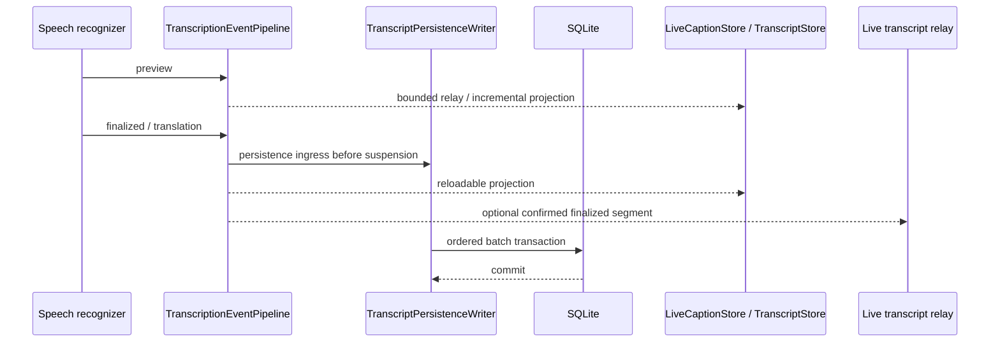
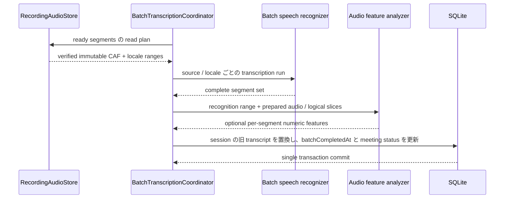
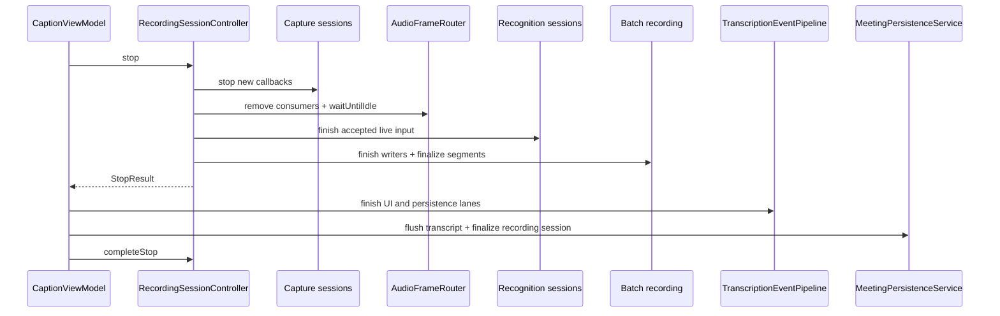

# 音声・文字起こしデータフロー

この文書は、Dahlia が microphone／system audio を受け取ってから、録音音声または文字起こしを正本として
永続化するまでの現在のデータフローを示す。横断的な信頼性 contract は
[`ARCHITECTURE.md`](../../ARCHITECTURE.md)、設計判断の理由は [ADR index](../adr/README.md) を参照する。

対象は capture、録音、逐次認識、ライブ字幕、ライブチャットへの文字起こし供給、リアルタイム／バッチ文字起こしの
SQLite 保存までとする。要約、書き出し、チャットでの利用方法、音声の保持期限と削除 protocol の詳細は扱わない。

最終確認日: 2026-09-09

## まず確認すること

新しい録音はすべて音声を保存し、停止後に最終文字起こしと要約を生成する。内部の `batch` 録音器・ジョブを再利用する。
旧 `realtime` セッションの読み取りは維持するが、新規録音の方式選択UIは置かない。

- 「ライブ文字起こしで初版を作成」は既定OFF。ONでは確定発話を初版として保存し、最終文字起こしの保存成功まで保持する。
- ライブ字幕、ライブチャット、初版保存は独立したconsumer。同じ音源の認識器を共有し、字幕だけをONにしても初版を保存しない。
- 「録音終了後に自動処理」は既定ON。OFFでは確認画面から同じ処理経路を開始する。
- UIの処理場所はローカル／リモートの2択。Local Accountはローカル固定とする。リモートでは `transcriptionModel` の有無で、Gemini文字起こし後の要約／Geminiによる文字起こし・要約の一括生成を切り替える。

`RecordingProcessing` は録音開始時の方式、ライブ初版、自動処理、言語、モデル・詳細度とジョブIDを
`recording_sessions.processingJSON` に保存する。以後の設定変更で録音中の方針を変えない。
Server設定の読込や通信成功を録音開始条件にしない。未取得時はローカル文字起こしを選び、Server要約の受付時に設定を固定する。
録音の保存完了後、既存のローカル文字起こしcoordinatorとServer summary jobへ接続し、再起動時は保存済み段階から復旧する。
クラウド方式は固定した録音のアーカイブとアップロードを待つ。後から追加した録音を要求に混ぜない。
同じ会議の処理は既存キューで順番に実行し、永続化した別々のジョブは統合せず、それぞれの完了状態を保存する。
明示的な再文字起こしはApple Speechによる新しい要求として受け付け、以前のServer要求・生成結果を再利用しない。
要約を選択した場合だけ新しい処理IDと設定を保存し、選択しない場合は文字起こしだけを更新する。

ローカルの最終文字起こしを保存してから要約する。クラウドの二段階方式も保存済み文字起こしを要約入力にする。
一括方式は1回の生成結果を同一トランザクションで保存する。キャンセルと既存の競合検出は遅延した結果の上書きを防ぐ。
失敗時も録音と既存の結果を保持する。処理成功による録音の即時削除は行わず、アーカイブ・保存期間・明示的削除の既存方針に従う。

文字起こし言語は保存音声のrange metadataとApple Speechによる最終文字起こしに使う。
ライブ字幕言語は共有する逐次認識器（初版・字幕・チャット）に使う。字幕言語を変更してもCAF rangeは切り替えない。
要約の出力言語はこれらと別の設定である。

## モードとライブ機能の組み合わせ

`TranscriptionSessionPlan` が、ライブ初版とライブ機能から必要なruntimeを導出する。以下は旧セッションの互換経路も含む。新規batchセッションで `liveTranscriptDraftEnabled` がONなら、他のライブconsumerにかかわらず音源ごとに1個の認識器を使用し、確定イベントを初版へ保存する。

| 正本文字起こし | ライブ字幕 | ライブチャット | 音源ごとの逐次認識器 | batch 音声録音 | 録音中の逐次イベントを正本として保存 | 正本の生成元 |
| --- | --- | --- | --- | --- | --- | --- |
| realtime | off | off | 1 | なし | 保存する | 逐次認識の確定イベント |
| realtime | on | off | 1 | なし | 保存する | 逐次認識の確定イベント |
| realtime | off | on | 1 | なし | 保存する | 逐次認識の確定イベント |
| realtime | on | on | 1 | なし | 保存する | 逐次認識の確定イベント |
| batch | off | off | 0 | あり | 保存しない | 停止後の ready CAF |
| batch | on | off | 1 | あり | 保存しない | 停止後の ready CAF |
| batch | off | on | 1 | あり | 保存しない | 停止後の ready CAF |
| batch | on | on | 1 | あり | 保存しない | 停止後の ready CAF |

この表の重要な読み方:

- realtime では `persistsRealtimeTranscript == true` であり、字幕やチャットの有無は正本の保存方針を変えない。
- batch では `recordsBatchAudio == true` であり、字幕やチャットのために逐次認識しても
  `persistsRealtimeTranscript == false` のままである。
- batch 中の字幕やチャットは低遅延の一時的な結果である。最終結果は ready CAF を再生して作り直すため、
  録音中の表示と停止後の正本文字起こしは一致しない場合がある。
- 逐次認識が不要な唯一の組み合わせは、ライブ字幕とライブチャットを使わない batch である。

## 用語と保存保証

| 用語 | この文書での意味 |
| --- | --- |
| accepted | owner が入力を処理対象として受理した状態。メモリ上の queue への受理だけでは、process 終了に耐える保存ではない |
| in-flight | callback、queue、worker、actor のいずれかで処理中の状態 |
| finalizing | audio segment を seal し、同期、検証、publish、DB 更新を進めている状態 |
| durable | Dahlia が正本として再読込できる永続化境界を完了した状態 |
| visible | UI projection に反映された状態。durable であることを意味しない |
| rebuildable | 別の durable source of truth から再生成でき、負荷時に集約または破棄できる状態 |

録音 callback から writer queue に入った音声と、`TranscriptionEventPipeline` の persistence lane に入った
確定イベントは、MainActor の停止から独立して処理を継続できる。ただし、これらはメモリ上の受理であり、
process crash に耐える durable commit ではない。

## 全体フロー

```mermaid
flowchart LR
    Mic["MicrophoneAudioCaptureSession"]
    System["SystemAudioCaptureSession<br/>SystemAudioCaptureManager"]
    Source["AudioSourcePipeline<br/>timestamp assignment"]
    Router["AudioFrameRouter"]

    Mic --> Source
    System --> Source
    Source --> Router

    Router -->|"batch mode"| Writer["SegmentedAudioSourceWriter<br/>bounded writer queue"]
    Writer --> Partial["active .partial.caf"]
    Partial --> Finalize["sync + verify + publish"]
    Finalize --> Ready["immutable .caf<br/>SQLite state = ready"]

    Router -->|"live recognition required"| LiveWorker["LiveAudioFrameWorker"]
    LiveWorker --> Recognizer["AudioBufferBridge<br/>SpeechTranscriberService"]
    Recognizer --> Events["TranscriptionEventPipeline"]

    Router -.->|"latest-wins / 約10 Hz"| Meter["AudioLevelMeteringWorker<br/>rebuildable UI projection"]
    Meter -.-> LevelUI["録音パネル<br/>音源別レベルメーター"]

    Events --> Caption["session history + bounded rendering<br/>LiveCaptionStore / TranscriptStore"]
    Events --> Chat["live transcript relay"]
    Events -->|"realtime policy"| StreamWriter["TranscriptPersistenceWriter"]
    StreamWriter --> TranscriptDB[("SQLite<br/>transcript_segments")]

    Ready -->|"after stop and confirmation"| Batch["BatchTranscriptionCoordinator"]
    Batch --> BatchCommit["BatchTranscriptionPersistence<br/>single transaction"]
    BatchCommit --> TranscriptDB
```

### Ownership boundaries

| Boundary | Primary owner | Responsibility |
| --- | --- | --- |
| Physical capture | `MicrophoneAudioCaptureSession`, `SystemAudioCaptureSession`, `SystemAudioCaptureManager` | OS capture lifecycle と raw buffer |
| Timestamp と fan-out | `AudioSourcePipeline`, `AudioFrameRouter` | 音源内で単調な session time を付与し、batch と live へ同期分配 |
| Recording runtime | `RecordingSessionController` | capture、recognition、segmented writer、停止順序の所有 |
| Audio persistence | `SegmentedAudioSourceWriter`, `RecordingAudioStore` | bounded ingestion、segment lifecycle、integrity、reconciliation |
| Progressive recognition | `LiveAudioFrameWorker`, `AudioBufferBridge`, `SpeechTranscriberService` | capture callback 外での変換と逐次認識 |
| Event distribution | `TranscriptionEventPipeline` | durable persistence と bounded UI／optional consumer の分離 |
| Realtime transcript | `TranscriptPersistenceWriter` | 確定イベントの順序、再試行、SQLite transaction |
| Batch transcript | `BatchTranscriptionCoordinator`, `BatchTranscriptionPersistence` | ready CAF の読出し、認識、成功結果の原子的反映 |
| UI projection | `TranscriptStore`, `LiveCaptionStore` | `TranscriptStore` は bounded／再読込可能、ライブ字幕はセッション履歴を差分投影して layout を遅延生成 |

## データと永続化境界

| Data | Owner／location | 受理または更新の意味 | durable になる時点 | 再生成 |
| --- | --- | --- | --- | --- |
| `AVAudioPCMBuffer` | OS capture callback | callback が buffer を渡した | durable ではない | OS から再取得できない |
| `CapturedAudioChunk` | `AudioSourcePipeline`／`AudioFrameRouter` | session-relative timestamp を付与して route 中 | durable ではない | 元 buffer を失うと再生成できない |
| writer queue の `AudioChunk` | `SegmentedAudioSourceWriter` memory | bounded queue が frame を accepted と数えた | durable ではない。overflow は録音失敗 | queue から失うと再生成できない |
| active partial CAF | app-managed recording directory | writer が可変 file へ frame を書いた | まだ published source of truth ではない | startup reconciliation の対象 |
| ready CAF | app-managed recording directory と `recording_audio_segments` | seal、同期、検証、rename、`ready` 更新が完了した | immutable CAF と対応する SQLite state が確定した時点 | 文字起こしを再生成できる |
| preview／preview translation | event pipeline と UI store memory | 現在の表示候補を更新した | durable にしない | 後続イベントまたは正本から置換 |
| realtime finalized event | event pipeline／persistence writer memory | UI より先に persistence lane へ受理した | `transcript_segments` の SQLite transaction が commit した時点 | batch 音声がなければ元音声からは再生成不能 |
| batch recognition result | `BatchTranscriptionCoordinator` memory | ready CAF から一式を生成した | transcript rows と batch 完了状態の transaction が commit した時点 | ready CAF が残る間は再生成可能 |
| transcript audio features | batch recognition work item memory | 認識に使った音声から発話区間の RMS、pitch、activity-gate ratio、pitch spread を best effort で集約した | 対応する `transcript_segments` row と batch 完了状態の transaction が commit した時点 | ready CAF が残る間だけ再生成可能 |
| transcript source of truth | SQLite `transcript_segments` | realtime の差分 insert または batch の一式置換 | SQLite commit 完了時 | UI projection を再構築できる |
| recording metadata | SQLite `recording_sessions` ほか | mode、開始／終了、batch 状態、audio progress を更新 | 各 SQLite commit 完了時 | ファイルだけから完全には再生成しない |

### 音声 segment の状態

`ready` は「永続的に保持する」という意味ではなく、検証済みの immutable CAF を正本として読める状態を表す。
確定 protocol、crash recovery、保持・削除の詳細は
[確定手順](../adr/desktop/recording-storage.md#確定手順) を参照する。

## Runtime scenarios

### 録音開始

1. `MeetingPersistenceService.createNew`／`createAppending` が meeting と `recording_sessions` を SQLite transaction で準備する。
2. `TranscriptionSessionPlan` から live recognition、batch recording、streaming persistence の要否を決める。
3. `TranscriptionEventPipeline` を開始し、`RecordingSessionController.prepare` が permission、recognition model、
   batch recording session、音源ごとの runtime を準備する。物理 capture はまだ開始しない。
4. batch では音源ごとの最初の segment と range consumer を準備し、router に batch consumer を接続する。
5. live recognition が必要な場合は音源ごとの認識器を開始し、router に一つの live worker を接続する。
6. capture session を開始する。すべての必須開始処理が成功した後、UI lifecycle を recording に進める。

開始途中で失敗した場合は、開始済み runtime を停止し、作成途中の persistence context を rollback する。

### Capture と fan-out

capture callback ごとに `AudioSourcePipeline.capture` が frame count から session-relative timestamp を計算する。
`AudioFrameRouter.route` は callback ごとの `Task` や MainActor hop を作らず、同じ chunk を有効な consumer へ分配する。

- batch consumer は `SegmentedAudioSourceWriter.appendBuffer` へ同期投入する。
- live consumer は `LiveAudioFrameWorker` へ投入し、format conversion と Speech recognition を callback 外で行う。
- 音量メーターは最新1フレームだけを保持する表示専用workerへ渡し、約10 Hzで音源別レベルを更新する。
  このprojectionは中間値を破棄でき、MainActorや表示処理を録音の保存・認識・停止drainから分離する。
- writer queue が満杯の場合は、その後の受付を閉じて `writeQueueOverflow` を録音失敗として表面化する。
- batch mode の live lane は低遅延の bounded queue であり、正本音声の writer lane とは独立して縮退できる。
- realtime mode は再処理可能な batch 音声を持たないため、live recognition input を lossless に扱う。

### リアルタイム文字起こしと字幕

`TranscriptionEventPipeline.enqueue` は、確定イベントについて suspension より前に persistence lane への ingress を確定する。
その後に UI と optional observer を処理するため、MainActor または字幕 consumer の停止が SQLite への進行を直接待たせない。

ライブ字幕の音源設定は `LiveCaptionStore` からオーバーレイ payload を作る際の表示フィルタである。既定では
システムオーディオだけを表示し、ユーザーが「マイク入力を含める」を有効にした場合はマイク由来の字幕も表示する。
この設定は録音する音声、逐次認識器への入力、SQLite の正本文字起こしには影響しない。
`LiveCaptionStore` は現在の録音セッションの字幕履歴を停止まで保持する。オーバーレイは差分を最大 5 Hz で反映し、
最新 1〜5 件だけを高さ計測して全履歴の行を遅延生成するため、preview 更新ごとに全件を再投影・layout しない。

preview は保存しない。finalized segment と確定 translation は `TranscriptPersistenceWriter` が順序を保ち、
SQLite failure 時は actor 内に保持して backoff 付きで再試行する。process が終了すれば memory backlog は失われ得るため、
durable の境界は ingress ではなく SQLite commit である。

ライブ字幕翻訳は字幕オーバーレイの表示とは独立した設定である。リアルタイム文字起こしではオーバーレイが無効でも、
翻訳が有効なら確定 translation を正本文字起こしと同じ persistence lane から SQLite へ保存する。

### バッチ文字起こしと字幕

batch mode では、字幕またはライブチャットを有効にした場合だけ録音中の逐次認識を追加する。そのイベントは
`TranscriptPersistencePolicy.deferred` により正本文字起こしとして保存しない。逐次認識が失敗しても audio recording が
継続可能なら、ライブ機能を縮退して停止後の batch transcription を維持する。

録音中のライブ字幕にはライブ字幕翻訳設定を適用するが、停止後に生成する batch の正本文字起こしは翻訳しない。

停止後、ユーザーの確認を経て `BatchTranscriptionCoordinator` が session を queue へ登録する。

固定言語では、同一音源、同一形式、同一 locale で session time が連続する verified CAF range を一つの論理 run として
同じ `SpeechAnalyzer` へ順次供給する。ready CAF 自体は結合または変更せず、入力は一 buffer ずつ遅延読出しする。
自動判定では各 CAF の言語を個別に判定した後、固定言語と同じ条件を満たす同一判定 locale の連続 CAF を
一つの論理 run として認識する。

各 Apple Speech 解析には無進捗 watchdog を設ける。解析開始、論理 run 内の CAF slice 消費、認識結果の受信を進捗とし、
解析開始時に固定した設定時間（1／2／3分、既定1分）進捗がなければ `SpeechAnalyzer` をキャンセルして失敗として保存する。
これは総処理時間の上限ではない。ready CAF は保持し、起動時は音声整合性の復旧だけを行って batch recognition を自動再開しない。
前プロセスで queued／running だった処理は中断状態へ移し、ユーザーはミーティング詳細または未処理録音一覧から
保持音声を明示的に再処理できる。複数の batch recognition は一つずつ直列実行する。
再試行成功後も、現在の保存期間を recording session の `endedAt` と `batchCompletedAt` の遅い方から計算して削除対象を判定する。期限を過ぎていれば、
既存の purge state machine で音声を削除する。

認識途中の結果は正本へ部分反映しない。成功した全結果を `BatchTranscriptionPersistence.complete` が一つの transaction で
反映する。再文字起こし中は以前の成功結果を利用でき、新しい一式が成功した時だけ置き換える。

各 recognition work item は、認識直後かつ一時的な prepared audio または logical CAF slices が有効な間に、
確定区間ごとの軽量な音声特徴量を一回の走査で集約する。特徴量は補助データであり、抽出失敗は文字起こし完了、
既存の retry policy、音声 purge を妨げず、その区間または work item の値を `NULL` として保存する。
version 1 の `audioVoicedFrameRatio` は pitch 検出率ではなく、全分析 frame に占める activity gate 通過 frame の比率を表す。
音量は RMS dBFS の相対値であり、OS の処理や音源ごとの gain が異なるため microphone と system の間では比較せず、
同一 recording session・同一音源内の参考値として扱う。リアルタイム文字起こしでは音声特徴量を生成しない。

### 正常停止

この順序により、capture 停止前に受理した callback、router、recognition、audio writer、transcript persistence を
それぞれの owner が drain する。batch transcription の enqueue はこの停止処理に含めず、音声確定とユーザー確認の後に行う。
アプリ終了時はこの録音停止と永続化を待ち、進行中の batch recognition をキャンセルして中断状態を保存してから終了する。
文字起こしの永続化を完了できない場合は終了を承認せず、エラーを表示して保存の再試行を可能にする。

## Failure と recovery

| Failure | Preserved behavior | Surface／recovery |
| --- | --- | --- |
| MainActor／UI の一時停止 | accepted audio と realtime persistence lane は UI を待たず進む | UI は解放後に SQLite または bounded projection から catch up |
| audio writer queue overflow | silent drop を行わず、それ以前の ready segment を保持 | recording error。新規 buffer 受付を閉じる |
| live recognition failure in realtime | 正本文字起こしを継続できない | fatal runtime failure として停止へ進む |
| live recognition failure in batch | audio writer が健全なら正本音声を継続 | 字幕／chat を縮退し、停止後 batch を維持 |
| realtime SQLite failure | pending event と順序を writer actor 内で保持 | exponential backoff。停止時にも flush failure を返す |
| batch recognition failure／アプリ終了による中断 | 旧成功 transcript と ready audio を保持 | failure／interrupted state を保存し、手動再試行を待つ |
| Apple Speech の無進捗停止 | 旧成功 transcript と ready audio を保持 | 待機時間を含む専用 failure state を保存し、自動再試行せず手動再試行を待つ |
| batch audio feature extraction failure | 認識済み transcript と現在の録音保存期間を維持 | sanitized error を報告し、該当 feature columns を `NULL` にする |
| crash 中の partial／finalizing CAF | 既存 ready segment を変更しない | startup reconciler が DB state と file を照合 |
| ready CAF の missing／mismatch | 自動再作成、上書き、削除をしない | `failed` と reconciliation issue を記録 |

現在、realtime transcript persistence backlog の上限と overload policy は計測後に決める未解決事項である。
この gap を「無制限で安全」または「UI と同様に破棄可能」と解釈しない。最新の状態は
[`ARCHITECTURE.md` の Conformance Status](../../ARCHITECTURE.md#conformance-status) を参照する。

## 実装を追う

| Question | Start here |
| --- | --- |
| どの組み合わせで recognition／recording を作るか | [`TranscriptionSessionPlan`](../../apps/desktop/Sources/Dahlia/Models/TranscriptionSessionPlan.swift) |
| capture buffer をどこへ分配するか | [`AudioSourcePipeline`](../../apps/desktop/Sources/Dahlia/Audio/AudioSourcePipeline.swift)、[`AudioFrameRouter`](../../apps/desktop/Sources/Dahlia/Audio/AudioFrameRouter.swift) |
| audio queue と segment rotation はどう動くか | [`SegmentedAudioSourceWriter`](../../apps/desktop/Sources/Dahlia/Audio/SegmentedAudioSourceWriter.swift) |
| segment をいつ ready にするか | [`RecordingAudioStore`](../../apps/desktop/Sources/Dahlia/Services/RecordingAudioStore.swift) |
| capture／recognition／writer の lifecycle を誰が所有するか | [`RecordingSessionController`](../../apps/desktop/Sources/Dahlia/Services/RecordingSessionController.swift) |
| UI と persistence をどう分離するか | [`TranscriptionEventPipeline`](../../apps/desktop/Sources/Dahlia/Services/TranscriptionEventPipeline.swift) |
| realtime transcript をいつ commit するか | [`TranscriptPersistenceWriter`](../../apps/desktop/Sources/Dahlia/Services/TranscriptPersistenceWriter.swift) |
| batch transcript をいつ一式反映するか | [`BatchTranscriptionCoordinator`](../../apps/desktop/Sources/Dahlia/Services/BatchTranscriptionCoordinator.swift)、[`BatchTranscriptionPersistence`](../../apps/desktop/Sources/Dahlia/Services/BatchTranscriptionPersistence.swift) |

## 文書の更新条件

次を変更する場合は、同じ変更でこの文書を更新する。

- `TranscriptionSessionPlan` の mode／live capability 導出
- capture frame の consumer、queue policy、overflow behavior
- audio segment の状態、publish、recovery、durability boundary
- `TranscriptionEvent` の保存対象または UI projection 分離
- realtime／batch transcript の transaction boundary
- 正常停止時の受付停止と drain 順序

実装規約や検証コマンドは `AGENTS.md` に置き、この文書へ複製しない。新しい設計判断と理由は ADR に記録し、
この文書には採用後の現在フローだけを反映する。

## Transcript versions

Server は `transcripts` と `transcript_segments` に各版の全文を保持する。Desktop の `transcripts` は最新の生成情報だけを保持し、既存の segment/body table は最新本文だけを保持する。履歴番号 `version` と同期用 `syncRevision` は別の値とする。

ライブ (`apple-speech-live`) は開始時に版を確保し、同じモデルの既存本文を引き継ぐ。確定 segment をその版へ追記し、生成終了を確認した日時だけを `endedAt` に記録する。明示キャンセルも終了確認に含む。異常終了からの復旧では終了日時を推測しない。バッチ (`apple-speech`) の同モデル追加録音は追加音声だけを認識し、既存本文と結合した全文を新しい版として保存する。モデル変更・明示的な再文字起こしは会議の全録音を処理し、全処理成功時だけ本文・生成情報・完了状態・送信 snapshot を同じ transaction で確定する。失敗・キャンセルでは旧本文を保持する。

音声を保存しない旧ライブ録音や保持期限切れが含まれる場合、全文再生成は利用不可とし、部分結果で旧本文を置換しない。Server の Gemini 生成は metadata の各 run に元録音の番号・ソース・チェックサムを記録する。Desktop の run は内部録音 session ID を記録する。クラウド文字起こしやその後のライブ追記を Apple で全文再生成するときは、全 run の元録音が手元の対象録音と一致することを開始時と保存 transaction 内で確認する。

Server の生成が実行中または成功済みなら、通信・結果同期の再試行は同じ job ID を再開する。Server が失敗・キャンセル済みの場合だけ新しい試行を作る。 Desktop の再試行は前の Task の終了処理を待ってから永続状態を再開し、同じ ID の遅延したキャンセル処理と競合させない。過去のキャンセルはその試行の遅延結果を拒否するが、後続の新しい処理が保存済み音声を利用することは妨げない。

ローカル要約の適用済み状態と適用後の本文は、要約保存と同じ transaction で処理状態へ記録する。書き出し失敗からの再試行は生成済み結果を使い、現在の本文が一致するときだけ書き出しを再開する。要約本文・タグ・送信イベントの再保存は行わない。 要約保存時点では処理を saving に保ち、指定した書き出しが完了してから succeeded にする。書き出し失敗は failed として保存し、再起動後も再試行できる。

Segment の `startedAt` / `endedAt` は発話の絶対日時であり、ライブ・バッチとも従来の時刻を維持する。バッチは元の録音開始日時に対象区間の offset と認識結果の相対秒数を加算する。`createdAt` は確定 segment を生成した絶対日時で、発話時刻や Server 受信時刻ではない。再送・別版へのコピーでは維持し、再文字起こしでは新しい日時を記録する。未確定 preview はメモリだけに置き、保存する segment に `isConfirmed` は持たせない。

既存 Desktop segment の `createdAt` は合意したミーティング終了時刻で補完する。終了済み録音 session の最後の `endedAt` を優先し、なければ録音開始と duration から求める。未終了 session がある場合や終了時刻が不明な場合は NULL のままにする。元の発話時刻、session 対応、累積 offset、録音データ、本文、未送信操作を保全する前進 migration とする。

Transcript の `status` は保存しない。`endedAt` があれば `ended`、それ以外は最新の既知の segment `createdAt` から5分以内（境界を含む）を `active`、それより後を `inactive`、作成日時がなければ `unknown` とする。5分は通常の発話間隔や送信遅延を許容する活動推定の窓で、[共通定義](../../apps/desktop/Sources/DahliaRuntimeSupport/Resources/TranscriptPolicy.json)を Server / Web / Desktop で使う。 Server / Web は配布内の `apps/server/src/sync/transcript-policy.json` を読み、Desktop resource との一致をテストする。終了は成功を、活動推定は録音・接続の継続や異常終了を意味しない。Web は時刻境界でも表示を再計算し、Desktop / MCP は読み取り時に再計算する。
